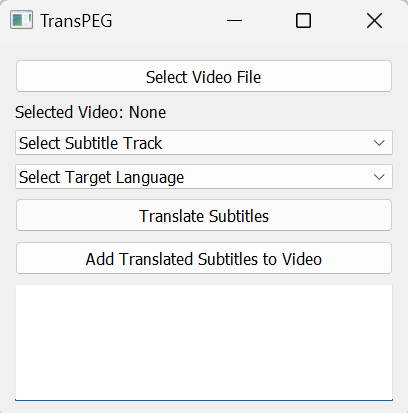
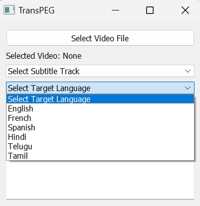

# TransPEG

# Subtitle Translator and Adder

This is a simple PyQt5 application that allows you to translate subtitles of a video file and add the translated subtitles to the video. It uses Google Translate for translation and FFmpeg for subtitle manipulation.

## Features

- Select a video file and extract subtitle tracks.
- Translate desired subtitles to various languages.
- Add translated subtitles to the original video.
- Supports popular languages like English, French, Spanish, Hindi, Telugu, and Tamil.

## Requirements

- Python 3.x
- PyQt5
- googletrans
- FFmpeg

## Installation

### Install the dependencies and just run the .exe file or run the python script.

1. Clone this repository:

   ```bash
   git clone https://github.com/VishnuSrivatsava/TransPEG.git

2. Install the required dependencies:

    ```bash
    pip install pyqt5 googletrans ffmpeg-python
    ```
3. Run the application:
    ```bash
    python subtitle_translator.py
    ```
## Screenshots





## Notes

- Make sure you have `ffmpeg` properly installed on your system.
- The application uses Google Translate for translation.
- Translated subtitles are saved as `translated_subtitles.srt`.

## License

This project is licensed under the [MIT License](LICENSE).

    
